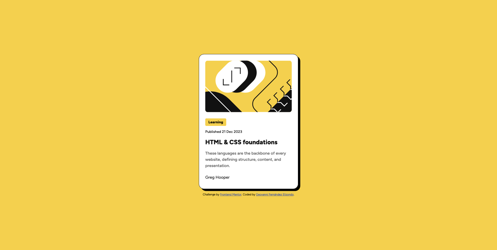

# Frontend Mentor - Results summary component solution

This is a solution to the [Blog preview card challenge on Frontend Mentor](https://www.frontendmentor.io/challenges/blog-preview-card-ckPaj01IcS). Frontend Mentor challenges help you improve your coding skills by building realistic projects.

## Table of contents

- [Overview](#overview)
  - [The challenge](#the-challenge)
  - [Screenshot](#screenshot)
  - [Links](#links)
- [My process](#my-process)
  - [Built with](#built-with)
  - [What I learned](#what-i-learned)
- [Author](#author)

## Overview

### The challenge

Users should be able to:

- See hover and focus states for all interactive elements on the page

### Screenshot

### Links

- Solution URL: [Add solution URL here](https://your-solution-url.com)
- Live Site URL: [blog-preview-component-gfz.netlify.app](blog-preview-component-gfz.netlify.app)

## My process

### Built with

- Semantic HTML5 markup
- CSS custom properties
- BEM methodology
- Flexbox
- Mobile-first workflow

### What I learned

In this challenge, I improved my understanding of semantic HTML structure and the BEM methodology for organizing styles efficiently. I also deepened my knowledge of CSS custom properties, allowing for a more scalable and maintainable design system. Additionally, I practiced working with Flexbox to create a responsive layout and applied a mobile-first approach to ensure optimal display across different screen sizes. Lastly, I experimented with subtle hover effects and shadows to enhance the user experience.

## Author

- Frontend Mentor - [Geovanex24](https://www.frontendmentor.io/profile/Geovanex24)
- Twitter/X - [fernandezel_24](https://x.com/fernandezel_24)
